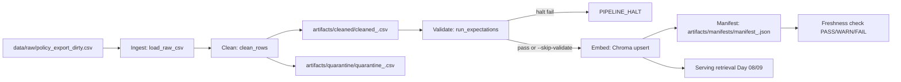

# Kiến trúc pipeline — Lab Day 10

**Nhóm:** C401-A4 
**Cập nhật:** 15/04/2026

---

## 1. Sơ đồ luồng (bắt buộc có 1 diagram: Mermaid / ASCII)

> `run_id` xuất hiện ở log, tên file artifacts và metadata embed. Freshness đo từ `latest_exported_at` trong manifest.

---

## 2. Ranh giới trách nhiệm

| Thành phần | Input | Output | Owner nhóm |
|------------|-------|--------|--------------|
| Ingest | `data/raw/policy_export_dirty.csv` | Raw rows, log `raw_records`, `run_id` | Ingestion Owner |
| Transform | Raw rows | `cleaned_<run_id>.csv`, `quarantine_<run_id>.csv` | Cleaning/Quality Owner |
| Quality | Cleaned rows | Expectation results, cờ halt (`PIPELINE_HALT`) | Cleaning/Quality Owner |
| Embed | Cleaned CSV | Upsert vào Chroma collection + prune id cũ | Embed Owner |
| Monitor | Manifest (`manifest_<run_id>.json`) | Kết quả freshness PASS/WARN/FAIL | Monitoring/Docs Owner |

---

## 3. Idempotency & rerun

Pipeline dùng **upsert theo `chunk_id`** nên rerun không tạo duplicate vector cho cùng một chunk.

Ngoài ra, trước khi upsert pipeline có bước **prune**: xóa các `ids` đã có trong Chroma nhưng không còn tồn tại ở cleaned run hiện tại. Vì vậy collection luôn phản ánh snapshot publish mới nhất, không bị stale chunk.

---

## 4. Liên hệ Day 09

Pipeline Day 10 đóng vai trò lớp dữ liệu cho retrieval Day 09:

- Day 10 đảm bảo dữ liệu đã clean + pass expectation trước khi embed.
- Collection sau embed (`CHROMA_COLLECTION`, mặc định `day10_kb`) có thể được agent/retrieval ở Day 09 dùng để trả lời policy/IT Helpdesk.
- Với kịch bản inject (`--no-refund-fix --skip-validate`), có thể quan sát regression retrieval; rerun chuẩn sẽ phục hồi chất lượng.

---

## 5. Rủi ro đã biết

- Người chạy nhầm `--skip-validate` trong môi trường thật có thể đẩy dữ liệu lỗi vào vector DB.
- Khi thêm `doc_id` mới nhưng quên cập nhật allowlist/contract sẽ làm tăng quarantine hoặc mất dữ liệu cần publish.
- Định dạng `exported_at` không chuẩn có thể gây FAIL expectation hoặc freshness sai.
- Drift giữa canonical source và raw export có thể làm retrieval trả lời sai version nếu thiếu theo dõi eval định kỳ.
